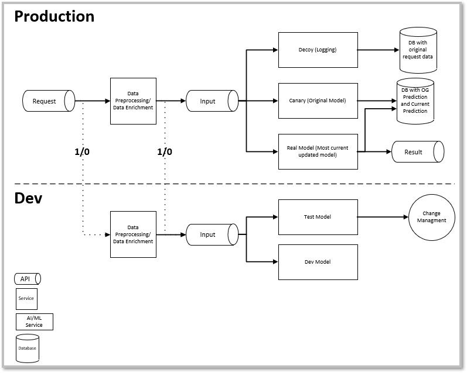

<H2>Project Overview</H2>

In the previous sections I have trained, deployed, and built an API for the Titanic Model, so I am all done right?  Unfortunately machine learning models are not train, deploy, and forget.  For models to be relevant to a user they must be monitored for model drift.  In addition, when updating a model currently in production it is important to evaluate it on current data to ensure it performs at least as good as the current model.  The last thing that should happen is the deployment of a model that performs worse than what was running.  

As a result of the need to monitor production and development models this part of the project will focus on the following areas:

<ol>
<li>Deploy a MongoDB to store model results</li>
<li>Decide on basic data schema</li>
<li>Update Model API to send input data and results to database</li>
<li>Retrieve model metrics from database</li>
</ol>

<H2>Understanding a Machine Learning Rendezvous Architecture</H2>
In the book *Machine Learning Logistics* the authors Ted Dunning and Ellen Friedman demonstrate the importance of model maintenance.  To help monitor current model and future model performance they propose the use of a *Rendezvous Architecture*.  In a Rendezvous Architecture a request is not sent to a single model but rather three "models" with only one result being sent back to the user.  The three models are a Decoy, Canary, and Real Model.  The Decoy model just logs the original model inputs, the canary model is a baseline model to help evaluate current model performance, and finally you have the real model which returns results.  The real key is each one of these models logs their results so the model developers can have a historical logs of model predictions.

For this project I am taking their basic design and modifying to resemble the architecture below.


In this architecture the API receives a request.  The request is sent to a baseline model, what Ted Dunning and Ellen Friedman call the canary, the production model, and any dev models.  The original data inputs, the transformed data, and each model output is sent to the database.  Finally the production model predictions are sent back to the user.  By saving all this data future model maintainers are able to see the original data sent to the API, data transformations for each model, and each model results.  This data will enables maintainers to monitor model drift.  It is also easy to add development models and save predictions, this will help evaluate if a model should be deployed or shelved.  


<H2>Decide and Deploy the Database</H2>
I find many times when I am coding a solution I spend more time researching and thinking than actual coding.  I consider it a measure three times cut once equivalent.  I thought about just generating logs and dumping them into some type of object storage like S3.  I thought about just sending the logs to a SQL database using a single table.  I finally decided on using MongoDB.  The primary reason is the schemaless design.  This allows me the flexibility to add fields or remove as required.  For example, if I decide to add a model in for development I can easily add a model and log the results.  If the model does not work, I can easily remove it and there will be no impact on the database.  The only thing that would be required is a naming convention and documentation to ensure there is no confusion.  Below is the schema I am using to track the data and predictions.

```
data
└─── Date/Time
└─── Passenger ID
└─── Input Data
│   └─── Passenger Class
│   └─── Sex
│   └─── Siblings
│   └─── Parents
│   └─── Fare
│   └─── Embarked Location
│   └─── Age
└─── Baseline Model
│   └─── Model Name
│   └─── Model Data Transformations
│   │   └─── Passenger Class
│   │   └─── Gender
│   │   └─── Siblings
│   │   └─── Parents
│   │   └─── Fare
│   │   └─── Embarked
│   │   └─── Age
│   └─── Predicted Results (Binary Format 1/0)
│   └─── Predicted Results (Word Format Survived/Died)
└─── Production Model
│   └─── Model Name
│   └─── Model Data Transformations
│   │   └─── Passenger Class
│   │   └─── Gender
│   │   └─── Siblings
│   │   └─── Parents
│   │   └─── Fare
│   │   └─── Embarked
│   │   └─── Age
│   └─── Predicted Results (Binary Format 1/0)
│   └─── Predicted Results (Word Format Survived/Died)

```

The great part of this is I am now able to see the raw input data as well as any data transformations the model conducted.  When making model adjustments this will give me a greater understanding of how the data transformations are impacting model performance on live data.


<H2>Data Analysis</H2>
Now all the data is in a place where it can be easily accessed I can load the data into a notebook and begin examining it.  But as the site <a href="https://e2e-web.descriptdata.net/" target="_blank" rel="noopener noreferrer">e2e Titanic Prediction Model</a> is not easy to find and the call for on demand Titanic survival predictions is not in high demand, I had to generate some fake data.  


<br>


While this data is fake, if it was real it could help the model team understand the discrepancy between the training data used and the data actually being sent to the prediction model.


Now I am able to combine the results from multiple models into a single dataframe.  I can use this dataframe to further examine how the models perform against each other.  For this example there is not much to examine as both the baseline and production models are the same model.  For the next and final article I will examine how this rendezvous architecture can help me improve the model for deployment and create a model for development.


<H2>Conclusion</H2>
One thing I have liked about this whole project is each stage has presented me with an interesting challenge in a different area.  For this part of the project the challenge was to examine the best database to use, then how to structure the schema.  Then there was going back through the API built in the last section and refactoring it to send data to the database.  In the next section I will wrap up this project and come full circle to create new models.
